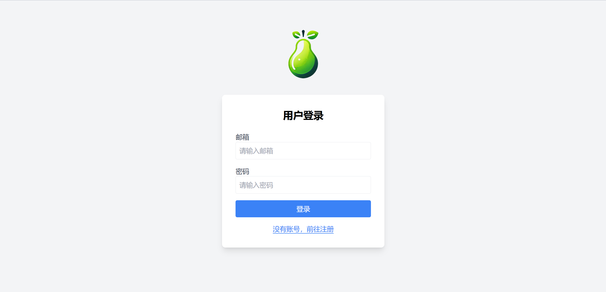
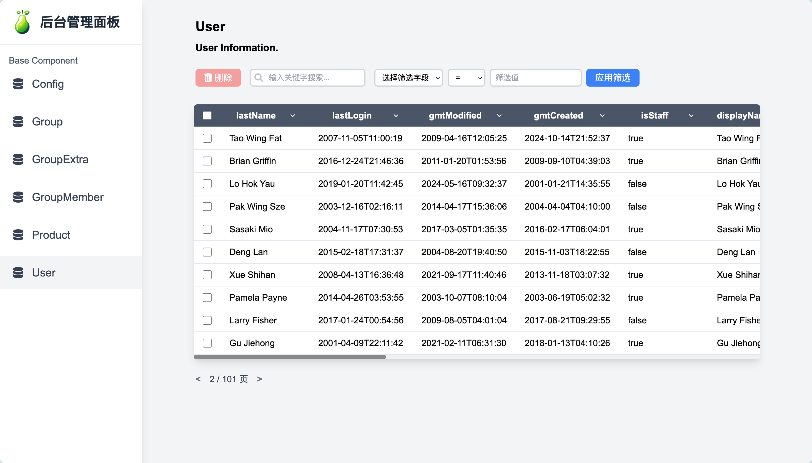

# Pear 单体应用快速开发框架

<div align="center">
    
    <h1>Pear Spring Boot Starter</h1>
    <p>🚀 专为Java开发者设计的单体应用快速开发框架</p>
    <p>
        <a href="README.md">中文</a> | <a href="README_EN.md">English</a>
    </p>
    <p>
        <a href="https://spring.io/projects/spring-boot">
            
        </a>
        <a href="https://www.oracle.com/java/">
            
        </a>
        <a href="https://mybatis.org/">
            
        </a>
        <a href="https://maven.apache.org/">
            
        </a>
        <a href="https://github.com/MuziSuper/pear-spring-boot-starter/releases">
            
        </a>
        <a href="https://github.com/MuziSuper/pear-spring-boot-starter/blob/main/LICENSE">
            
        </a>
    </p>
    <p>
        <a href="https://github.com/MuziSuper/pear-spring-boot-starter/stargazers">
            
        </a>
        <a href="https://github.com/MuziSuper/pear-spring-boot-starter/network">
            
        </a>
    </p>
</div>

## ✨ 特性

- 🛠️ **开箱即用**: 快速集成到Spring Boot项目中
- 🎨 **可视化后台**: 内置美观的管理界面
- ⚡ **高效开发**: 通过注解自动生成CRUD接口
- 🔄 **钩子机制**: 支持数据处理前后自定义逻辑
- 📊 **日志系统**: 多级别日志记录与归档
- 🔥 **缓存系统**: 支持LRU与LFU缓存策略与Redis模式
- 🔐 **权限控制**: 用户态和系统态权限分级校验
- 🧠 **智能配置**: 支持properties文件与配置类双模式配置

## 📦 快速开始

### Maven依赖

```
<dependency>
  <groupId>cn.muzisheng.pear</groupId>
  <artifactId>pear-spring-boot-starter</artifactId>
  <version>1.2.2</version>
</dependency>
```

## 🖥️ 界面预览

| 登录页面 | 注册页面 | 仪表盘 |
|---------|---------|--------|
|  |  |  |

**默认访问路径:**
- 登录: `http://localhost:8080/auth/login`
- 注册: `http://localhost:8080/auth/register`
- 仪表盘: `http://localhost:8080/auth/dashboard`

## 📚 使用指南

### 启用Pear
通过在主启动类上添加`@PearApplication`注解启用Pear，如果项目中添加了MySQL的配置，则会自动在该MySQL中创建名为`pear`的数据库并创建多个框架需要使用到的基础表结构；
```java
@SpringBootApplication
@PearApplication
public class DemoApplication {
    public static void main(String[] args) {
        SpringApplication.run(DemoApplication.class, args);
    }
}
```

### 实体类定义

使用[@PearObject](file:///Applications/LocalGit/pear-spring-boot-starter/pear-spring-boot-core/src/main/java/cn/muzisheng/pear/annotation/PearObject.java#L7-L46)和[@PearField](file:///Applications/LocalGit/pear-spring-boot-starter/pear-spring-boot-core/src/main/java/cn/muzisheng/pear/annotation/PearField.java#L9-L62)注解定义实体类，框架会自动生成对应的实体的增删改查接口，并在后台页面中提供数据管理，根据配置信息对应字段会有相应的状态。
```
package cn.muzisheng.pear.example;

import cn.muzisheng.pear.annotation.PearField;
import cn.muzisheng.pear.annotation.PearObject;
import com.baomidou.mybatisplus.annotation.FieldFill;
import com.baomidou.mybatisplus.annotation.TableField;
import com.baomidou.mybatisplus.annotation.TableName;
import jakarta.persistence.*;
import lombok.Data;
import org.springframework.stereotype.Component;

import java.time.LocalDateTime;

/**
 * 示例类展示如何使用@PearObject和@PearField注解
 */
@Data
@Component
@TableName("example_demo")
@PearObject(
    TableName = "custom_table_name",  // 自定义表名
    group = "example",               // 分组
    desc = "这是一个示例类，用于展示Pear注解的使用",  // 描述
    path = "/example/demo",          // 访问路径
    editPage = "/demo/edit",         // 编辑页面地址
    listPage = "/demo/list",         // 列表页面地址
    pluralName = "demos",            // 复数名称
    iconUrl = "/icons/demo.png",     // 图标URL
    isInvisible = false              // 是否隐藏
)
public class ExampleDemo {

    @Id
    @GeneratedValue(strategy = GenerationType.IDENTITY)
    @PearField(
        isPrimaryKey = true,         // 主键
        isShow = true,               // 显示
        isEdit = false,              // 不可编辑
        isFilterable = true,         // 可过滤
        isOrderable = true,          // 可排序
        isSearchable = true,         // 可搜索
        isRequire = true,            // 必填
        placeholder = "自动生成ID",    // 提示信息
        label = "ID"                 // 显示标签
    )
    private Long id;

    @TableField(value = "demo_name")
    @PearField(
        isShow = true,
        isEdit = true,
        isFilterable = true,
        isOrderable = true,
        isSearchable = true,
        isRequire = true,
        placeholder = "请输入名称",
        label = "名称",
        isUniqueKey = true           // 唯一键
    )
    private String name;

    @PearField(
        isShow = true,
        isEdit = true,
        isFilterable = false,
        isOrderable = false,
        isSearchable = true,
        isRequire = false,
        placeholder = "请输入描述",
        label = "描述"
    )
    private String description;

    @PearField(
        isShow = true,
        isEdit = true,
        isFilterable = true,
        isOrderable = true,
        isSearchable = false,
        isRequire = false,
        placeholder = "是否激活",
        label = "状态"
    )
    private Boolean active;

    @TableField(fill = FieldFill.INSERT, value = "create_time")
    @PearField(
        isShow = true,
        isEdit = false,
        isAutoInsertTime = true,     // 自动插入时间
        label = "创建时间"
    )
    private LocalDateTime createTime;

    @TableField(fill = FieldFill.INSERT_UPDATE, value = "update_time")
    @PearField(
        isShow = true,
        isEdit = false,
        isAutoUpdateTime = true,     // 自动更新时间
        label = "更新时间"
    )
    private LocalDateTime updateTime;

    @Transient
    @PearField(
        isShow = false,              // 不显示
        isEdit = false,              // 不可编辑
        notColumn = true             // 非数据库字段
    )
    private String tempField;
}
```


### 注解说明
#### PearObject 注解

PearObject 是一个用于标注实体类的注解，用于定义与数据库表相关的元数据信息。

#### 功能说明
- 标记实体类为 Pear 框架管理的对象
- 定义实体对应的数据库表名、访问路径等配置
- 支持配置前端展示相关属性，如页面地址、图标等

#### 属性列表

| 属性 | 类型 | 默认值 | 说明 |
|------|------|--------|------|
| TableName | String | "" | 数据库表名 |
| group | String | "" | 模型分组 |
| desc | String | "" | 模型描述 |
| path | String | "" | 访问路径 |
| editPage | String | "" | 编辑页面地址 |
| listPage | String | "" | 列表页面地址 |
| pluralName | String | "" | 复数名称 |
| iconUrl | String | "" | 图URL |
| isInvisible | boolean | false | 是否隐藏 |

---

#### PearField 注解

PearField 是一个用于标注实体类字段的注解，用于定义字段在数据库和前端展示中的行为，必须依托PearObject 注解。

#### 功能说明
- 定义字段在数据库操作和前端展示中的各种属性
- 控制字段的显示、编辑、搜索等行为
- 支持自动时间戳功能

#### 属性列表

| 属性 | 类型 | 默认值 | 说明 |
|------|------|--------|------|
| isShow | boolean | true | 是否显示 |
| isEdit | boolean | true | 是否可编辑 |
| isFilterable | boolean | true | 是否可过滤 |
| isOrderable | boolean | true | 是否可排序 |
| isSearchable | boolean | true | 是否可搜索 |
| isRequire | boolean | true | 是否必填 |
| isPrimaryKey | boolean | false | 是否主键 |
| isUniqueKey | boolean | false | 是否唯一键 |
| placeholder | String | "" | 默认值 |
| isAutoUpdateTime | boolean | false | 是否自动更新时间 |
| isAutoInsertTime | boolean | false | 是否自动插入时间 |
| label | String | "" | 客户端显示名称 |
### 初始化配置
当实体类被@PearObject注解，其类与字段信息就会封装成一个AdminObject对象，存储在AdminContainer容器中，可以在项目CommandLineRunner初始化时通过AdminObject.BuilderFactory对象对某个实体类的AdminObject对象进一步配置，如添加前后置钩子函数等：

```
@Component
public class PearInitializer implements CommandLineRunner {

  @Override
  public void run(String... args) {
    // 1. 获取基础模型
    List<AdminObject> adminObjects = AdminContainer.getAllAdminObjects();
    
    // 2. 配置自定义模型
    AdminObject.BuilderFactory builder = new AdminObject.BuilderFactory(Product.class)
      .setBeforeCreate((request, product) -> {
        // 创建前逻辑
        product.setCreatedAt(LocalDateTime.now());
        return product;
      })
      .setBeforeUpdate((request, product) -> {
        // 更新前逻辑
        product.setUpdatedAt(LocalDateTime.now());
        return product;
      })
      .setOrder(new Order("createdAt", Constant.ORDER_OP_DESC));
    
    // 3. 构建所有模型
    AdminContainer.buildAdminObjects(adminObjects);
  }
}
```


## ⚙️ 系统配置

### 配置方式说明

Pear支持多种配置方式，包括：

1. **properties文件配置**：通过application.properties进行传统配置
2. **配置类配置**：通过Java配置类进行类型安全的配置

### properties配置示例


```
# ==================================
# 缓存配置 (Cache)
# ==================================
app.cacheTemplate.expire=86400000  # 缓存过期时间(毫秒)，默认24小时
app.cacheTemplate.capacity=20      # 缓存容量，默认20

# ==================================
# 环境配置 (Config)
# ==================================
app.env.auth-prefix=/auth  # 认证路径前缀

# ==================================
# 日志配置 (Log)
# ==================================
app.log.level=INFO  # 日志级别
app.log.stdout-pattern=%d{yyyy-MM-dd HH:mm:ss.SSS} %highlight(%-5level) %-17black(%thread) %-82green(%logger{70}-%line) %highlight(%msg){black} %highlight(%ex){red} \n  # 标准输出格式
app.log.file-pattern=%d{HH:mm:ss.SSS} [%thread] %-5level %logger{36} - %msg%n  # 文件输出格式
app.log.file-path=log  # 日志文件路径
app.log.log-catalogue-address=log/log-day  # 日志目录
app.log.warn-catalogue-address=log/warn-day  # 警告日志目录
app.log.error-catalogue-address=log/error-day  # 错误日志目录

# ==================================
# Token配置
# ==================================
app.token.salt=pear_token_  # Token盐值
app.token.head=Bearer       # Token头前缀
app.token.expire=604800000  # Token过期时间(毫秒)，默认7天
app.token.issue=pear        # Token签发者
app.token.subject=authentication  # Token主题

# ==================================
# 用户密码配置
# ==================================
app.user.password.salt=PEAR_APPLICATION_SALT  # 密码加密盐值
```


### 配置类配置示例

```
@Configuration
public class PearConfig {
  
    @Bean
    public CacheConfig cacheConfig() {
        return CacheConfig.builder()
            .expire(3600000)  // 1小时
            .capacity(500)    // 容量500
            .build();         // 构建最终实例
    }
  
    @Bean
    public TokenConfig tokenConfig() {
        return TokenConfig.builder()
            .salt("custom_salt")
            .expire(86400000L)  // 24小时
            .head("Bearer ")
            .issue("pear_admin")
            .subject("auth")
            .build();
    }
  
    @Bean
    public UserConfig userConfig() {
        return UserConfig.builder()
            .passwordSalt("user_custom_salt")
            .build();
    }
}

```


## 🏗️ 系统架构

### 后端架构

- **核心框架**: Spring Boot 3.3.x
- **ORM**: MyBatis-Plus 3.5.x
- **认证**: JWT Token
- **日志**: Logback
- **缓存**: 内置LRU/LFU缓存(可扩展Redis)

## 📌 系统特性详解

### 多策略缓存系统

Pear实现了基于策略模式的缓存系统，支持LRU和LFU两种缓存淘汰算法：

1. **LRU(最近最少使用)**：基于LinkedHashMap实现，适合访问具有时间局部性的场景
2. **LFU(最不经常使用)**：基于TreeMap和LinkedHashSet实现，基于访问频率进行淘汰

```
// 缓存接口定义
public interface CacheInterface<K,V> {
  V get(K key);
  void put(K key, V value);
  void remove(K key);
  int size();
  void clear();
  boolean containsKey(K key);
}

// 缓存策略模式
public class CacheStrategy<K, V> {
  private CacheInterface<K, V> cacheTemplate;
  
  public void setCacheStrategy(CacheInterface<K, V> cacheTemplate) {
    this.cacheTemplate = cacheTemplate;
  }
  
  // ...其他方法...
}

// LRU缓存实现
public class LRUCacheUtil<K,V> implements CacheInterface<K,V> {
  // 基于LinkedHashMap实现
}

// LFU缓存实现
public class LFUCacheUtil<K,V> implements CacheInterface<K,V> {
  // 基于TreeMap和LinkedHashSet实现
}
```


### 注解式权限控制

Pear实现了基于代理模式的注解权限控制系统：

```
// 权限注解定义
@Target(ElementType.METHOD)
@Retention(RetentionPolicy.RUNTIME)
public @interface AccessCheck {
  String value();  // 权限标识
  String[] args() default {};  // 所需参数
}

// 权限切面实现
@Aspect
@Component
public class AccessCheckAspect {
  
  @Around("accessCheck()")
  public Object accessCheckFunc(ProceedingJoinPoint jp) throws Throwable {
    // 获取方法签名
    Method method = ((MethodSignature) jp.getSignature()).getMethod();
    // 获取方法注解
    AccessCheck beforeCreate = method.getAnnotation(AccessCheck.class);
    
    // 参数处理
    Object[] methodArgs = jp.getArgs();
    
    // 权限验证逻辑
    if (hasPermission(beforeCreate.value())) {
      // 执行目标方法
      return jp.proceed();
    } else {
      throw new ForbiddenException("没有访问权限");
    }
  }
  
  // 权限验证逻辑
  private boolean hasPermission(String permission) {
    // 实现具体的权限验证逻辑
  }
}
```


### 智能配置系统

Pear实现了灵活的配置系统，支持多种配置方式：

```
// 配置属性类
@ConfigurationProperties("app.cacheTemplate")
public class CacheProperties {
  private long expire;
  private int capacity;
  
  public void applyTo(CacheConfig config) {
    if (this.expire > 0) {
      config.setExpire(this.expire);
    }
    if (this.capacity > 0) {
      config.setCapacity(this.capacity);
    }
  }
}

// 缓存自动配置类
@Configuration
@EnableConfigurationProperties(CacheProperties.class)
public class CacheAutoConfiguration {
  
  @Bean
  @ConditionalOnMissingBean(CacheConfig.class)
  public CacheConfig defaultCacheProperties(CacheProperties properties) {
    CacheConfig config = new CacheConfig();
    properties.applyTo(config);
    return config;
  }
}
```


### 初始化配置

```
@Override
public void run(String... args) {
  // 命令行参数解析
  Options options = new Options();
  options.addOption(new Option("u", "superuser", true, "用户名"));
  options.addOption(new Option("p", "password", true, "用户密码"));
  options.addOption(new Option("h", "help", false, "帮助信息"));
  
  CommandLineParser parser = new DefaultParser();
  CommandLine cmd = parser.parse(options, args, true);
  
  // 处理数据库参数
  if (cmd.hasOption("u") && cmd.hasOption("p")) {
    String email = cmd.getOptionValue("u");
    String password = cmd.getOptionValue("p");
    User user = userDAO.getUserByEmail(email);
    
    if (user != null) {
      if (!userDAO.setPassword(user, password)) {
        throw new UserException(email, "密码更新失败");
      }
    } else {
      user = userDAO.createUser(email, password);
    }
    
    // 设置用户角色
    user.setIsStaff(true);
    user.setIsSuperUser(true);
    user.setActivated(true);
    user.setEnabled(true);
    
    if (!userDAO.save(user)) {
      throw new UserException(email, "用户保存失败");
    }
  }
  
  // 系统配置入库
  configService.checkValue(Constant.KEY_SITE_NAME, "pear", Constant.ConfigFormatText, true, true);
  configService.checkValue(Constant.ICON_SVG_ADDRESS, "../static/favicon.svg", Constant.ConfigFormatText, true, true);
  configService.checkValue(Constant.ICON_SVG_ADDRESS, "../static/favicon.png", Constant.ConfigFormatText, true, true);
  
  // 构建入口
  AdminContainer.buildAdminObjects(AdminContainer.getAllAdminObjects());
  userAddFunc();
}
```


## 🚧 待办事项

- [ ] 修复Redis必须依赖的问题
- [ ] 对外暴露Cache工厂Bean，可以创建缓存容器实例，可以通过配置设置默认参数如容器名、数据量、过期时间、缓存策略，对于Redis的缓存实例
      Bean只负责创建、安全的缓存策略转换、删除，对于数据的管理全交由缓存容器处理
      对于Pear的缓存容器实例，交由我自己创建
- [ ] 实现细粒度权限控制
- [ ] 改进密码修改表单安全性
- [ ] 优化前端删除操作体验
- [ ] 修改searchAllEnv方法获取打包后的properties文件

## 🤝 参与贡献

1. Fork 本项目
2. 创建新分支 (`git checkout -b feature/your-feature`)
3. 提交更改 (`git commit -am 'Add some feature'`)
4. 推送到分支 (`git push origin feature/your-feature`)
5. 创建Pull Request

## 📄 许可证

[MIT License](https://github.com/MuziSuper/pear-spring-boot-starter/blob/main/LICENSE) © 2025 MuziSuper