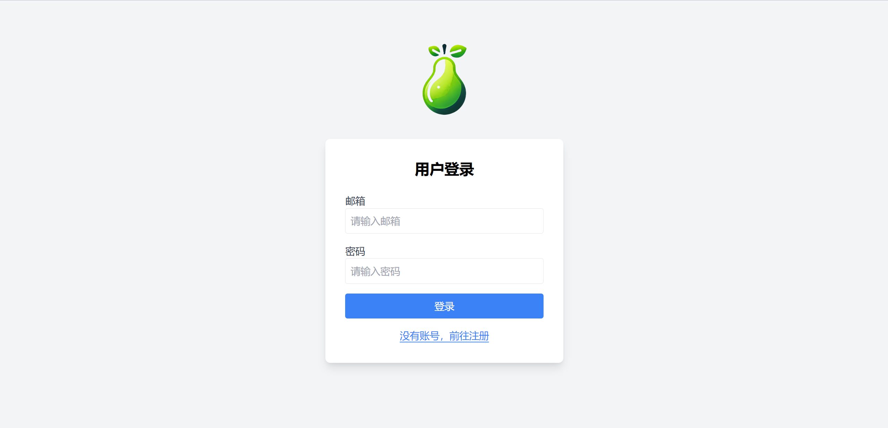

# PEAR visual back-end management system
<div align="center">
    <p>
        <a href="README.md">中文</a> | <a href="README_EN.md">English</a>
    </p>
    
    <p>🚀 Pear is a java middleware, which is convenient for the development of back-end personnel, with a built-in visual background management interface, which can add, delete, modify and check data, and provides hook methods, which can allow developers to perform some general operations before and after data processing, such as data encryption or desensitization, etc., and also provides an independent log system and cache system for log archiving and caching hot data, and more functions are still in development!
</p>
    <p>🛠️ Integration frameworks | 🎉 High versatility | 🖋️ Low operability | 🔑 High scalability</p>
    <p>
        <a href="https://spring.io/projects/spring-boot">
            
        </a>
        <a href="https://www.oracle.com/java/">
            
        </a>
        <a href="https://www.mysql.com/">
            
        </a>
        <a href="https://mybatis.org/">
            
        </a>
        <a href="https://maven.apache.org/">
            
        </a>
    </p>
    <p>
        <a href="https://github.com/heathcetide/hibiscus/stargazers">
            
        </a>
        <a href="https://github.com/heathcetide/hibiscus/network">
            
        </a>
        <a href="https://github.com/heathcetide/hibiscus/issues">
            
        </a>
    </p>
</div>

## Maven dependency
```xml
<!-- maven dependency of pear -->
<dependency>
    <groupId>cn.muzisheng.pear</groupId>
    <artifactId>pear-spring-boot-starter</artifactId>
    <version>1.1.13</version>
</dependency>
```

## Page display
Default path：http://localhost:8080/auth/login

Default path：http://localhost:8080/auth/register

Default path：http://localhost:8080/auth/dashboard


# Use the tutorial
## Model Definition - Use of annotations
### @PearObject
`@PearObject` Annotations are annotated on a class and are used to define meta information for the data model.

Attribute：

`TableName`：The name of the database table, which is an empty string by default.

`group`：Model grouping, default is an empty string.

`desc`：The description of the model is an empty string by default.

`path`：The access path of the model, which is an empty string by default.

`editPage`：Edit the address of the page, which is an empty string by default.

`listPage`：The address of the display page is an empty string by default.

`pluralName`：The plural form of the model, which defaults to an empty string.

`iconUrl`：The URL address of the model icon, which defaults to an empty string.

`isInvisible`：Whether to hide this model, defaults to false

### @PearField
`@PearField` Annotations are used to label the fields of the class and are used to define the meta information of the fields.

Attribute：

isShow：Whether or not to display this field on the page, defaults to false.

isEdit：Whether the field can be edited, defaults to false.

isFilterable：Whether this field can be filtered, defaults to false.

isOrderable：Whether the field can be sorted, defaults to false.

isSearchable：Whether the field is searchable or not, defaults to false.

isRequire：Whether this field is required or not, defaults to false.

isPrimaryKey：Whether this field is the primary key or not, the default value is false.

isUniqueKey：Whether the field is a unique key or not, defaults to false.

placeholder：The default value of the field, which defaults to an empty string.

label：The display name of the field, which is an empty string by default.
### Use Cases
```java
@Entity
@TableName("cat")
@Data
@Component
@PearObject(desc = "Cat is an animal.",pluralName = "cats")
public class Cat {
    @Id
    @GeneratedValue(strategy = GenerationType.IDENTITY)
    @PearField(isPrimaryKey = true,isShow = true,isEdit = true,isRequire = true,isFilterable = true,isSearchable = true,isOrderable = true)
    private Long id;
    @PearField(isShow = true,isEdit = true,isRequire = true,isFilterable = true,isSearchable = true,isOrderable = true)
    private String name;
    @PearField(isShow = true,isEdit = true,isRequire = true,isFilterable = true,isSearchable = true,isOrderable = true)
    private Integer age;
    @PearField(isShow = true,isEdit = true,isRequire = true,isFilterable = true,isSearchable = true,isOrderable = true)
    private String color;
    @PearField(isShow = true,isEdit = true,isRequire = true,isFilterable = true,isSearchable = true,isOrderable = true)
    private String breed;
    @PearField(isShow = true,isEdit = true,isRequire = true,isFilterable = true,isSearchable = true,isOrderable = true)
    private String image;
    @PearField(isShow = true,isEdit = true,isRequire = true,isFilterable = true,isSearchable = true,isOrderable = true)
    private String description;
    @Column(name = "`createdAt`")
    @PearField(isShow = true,isEdit = true,isRequire = true,isFilterable = true,isSearchable = true,isOrderable = true)
    private LocalDateTime createdAt;
}
```

## Model Complementation and Its Construction -- Use of BuilderFactory
In the project, an initialization class is created by implementing the `CommandLineRunner` interface. The `run` method is overridden to first obtain the list of `AdminObjects`, then fill in additional information through `AdminObject.BuilderFactory(Class clazz)`, such as hook functions or default field sorting rules, etc.; finally, the `AdminContainer.buildAdminObjects(adminObjects)` method is used to build all `AdminObject` instances for deploying CRUD interfaces.
```java
@Component
public class Initialized implements CommandLineRunner {
    @Override
    public void run(String... args) {
        // Obtain the list of AdminObject containers for the built-in model of pear
        List<AdminObject> adminObjects = AdminContainer.getAllAdminObjects();

        // Create theBuilderFactory for the Cat model
        AdminObject.BuilderFactory catBuilder = new AdminObject.BuilderFactory(Cat.class);

        // Set the callback function before deletion
        catBuilder.setBeforeDelete((request, admin) -> {
            if (admin instanceof Cat cat) {
                if (request.getParameter("name") != null) {
                    cat.setName(request.getParameter("name"));
                }
                return cat;
            }
            return admin;
        });

        // Set the collation
        catBuilder.setOrder(new Order("name", Constant.ORDER_OP_ASC));

        // Build the AdminObject and add it to the container
        AdminContainer.buildAdminObjects(adminObjects);
    }
}
```
## Configuration items
```properties
# User password salt
app.user.password.salt=salt
# Token encryption salt value
app.token.salt=salt
# Token prefix
app.token.head=Bearer 
# Token lifetime
app.token.expire=7*24*60*60*1000
# Log level
app.log.level=LOG
# Log output style
app.log.stdout-pattern=%d{yyyy-MM-dd HH:mm:ss.SSS} %highlight(%-5level) %-17black(%thread) %-82green(%logger{70}-%line) %highlight(%msg){black} %highlight(%ex){red} \n
# Log archive input style
app.log.file-pattern=%d{HH:mm:ss.SSS} [%thread] %-5level %logger{36} - %msg%n
# The name of the directory where all levels of logs are archived
app.log.file=log
# The name of the log archive directory at each level
app.log.log-catalogue-address=log/log-day
app.log.warn-catalogue-address=log/log-day
app.log.error-catalogue-address=log/log-day
# CacheStrategy expiration time
app.cathe.expire=24*60*60*1000
```

## Sketch

### server
Based on the 'SpringBoot' framework, it integrates the 'mybatisplus' ORM persistence layer to process data with the database connection, and integrates the 'logback' to manage the output and style of the log. The user can choose to add a 'redis' dependency to handle the system's caching (to be completed), or use the system's built-in caching system. There are multiple basic models designed to provide developers with encapsulated CURD services, and a user verification layer is designed to intercept users who do not have keys or whose keys have expired, and jump to the login registration page. There is also the most important reflection system for the framework, which reflects the class objects annotated by the user, obtains properties and methods, and encapsulates the CURD service for back-end data management. There are also other built-in systems, such as **Message System**, which is used for the important transaction processing of the whole system to generate messages to other third-party services such as mailboxes and DingTalk, and these functions are under development for the time being. . .
### client
Use H5 to call the backend 'api' with jQuery and render the page, and use 'tailwindcss' to atomize the 'css'. The page includes a landing page, a registration page, and a console page --> displaying, filtering, deleting, modifying, and adding various database tables.


## Task analysis of each system


### Basic user system

#### Function introduction

1. Realize the user's login and registration functions, and can directly log in through the token or local session;
2. Generate tokens, parse tokens, and determine the expiration of tokens (similar to carrot); 
3. Provide an interface for obtaining the current logged in user data;

### Logging system

#### Feature introduction

1. Optimized the log output style;
2. Archiving records of logs at different levels;

### Caching system

#### Feature introduction

1. Provide a thread-safe cache container that can store multiple pairs of key-value pairs and carry the timestamp of the current deposit, and also set the expiration time of all data in this container;
2. Provide a get method to get the cache, and return null if it misses;
3. Provide the add method to add the cache, and the existing key name will be overwritten;
4. Provide a containsmethod to determine whether this key exists in the cache;
5. Provide the remove method to delete the cache of this key, if this key does not exist, it will not be operated;

### Core General Purpose System

#### Feature introduction

1. In the developer project, you need to call the 'getPearAdminObjects()' method in 'CommandLineRunner' to get the list of 'AdminObject' objects of the base model of pear;
2. The developer creates an 'AdminObject' object based on the custom model and fills in its model-related information.
3. Put all AdminObject objects into the AdminContainer.adminObjects list;

#### The 'AdminObject' model in detail
```java
package cn.muzisheng.pear.model;

import cn.muzisheng.pear.handler.*;
import cn.muzisheng.pear.test.handler.*;
import cn.muzisheng.pear.test.model.*;
import lombok.Data;

import java.util.List;
import java.util.Map;

/**
 * Load the client-side model
 **/
@Data
public class AdminObject {
    /**
     * model
     **/
    private Class<?> model;
    /**
     * Model instances
     **/
    private Object modelElem;
    /**
     * The name of the group to which it belongs, and multiple related tables are grouped into one category
     **/
    private String group;
    /**
     * The name of the object
     **/
    private String name;
    /**
     * Object description
     **/
    private String desc;
    /**
     * The path prefix of its associated CURD
     **/
    private String path;
    /**
     * A list of fields can be displayed on the frontend
     **/
    private List<String> shows;
    /**
     * A list of all fields that are sorted by default
     **/
    private List<Order> Orders;
    /**
     * A list of editable fields
     **/
    private List<String> edits;
    /**
     * Fields that can be used for filtering
     **/
    private List<String> filterables;
    /**
     * Fields that can be used for sorting
     **/
    private List<String> Orderables;
    /**
     * Fields that can be used for search
     **/
    private List<String> searches;
    /**
     * Fields that must exist
     **/
    private List<String> requires;
    /**
     * A list of primary key fields
     **/
    private List<String> primaryKeys;
    /**
     * A list of unique key fields
     **/
    private List<String> uniqueKeys;
    /**
     * Plural names
     **/
    private String pluralName;
    /**
     * Detailed configuration of all fields in this table
     **/
    private List<AdminField> fields;
    /**
     * Edit the front-end routes for this table
     **/
    private String editPage;
    /**
     * This table displays the front-end routes
     **/
    private String listPage;
    /**
     * Script file object
     **/
    private List<AdminScript> AdminScripts;
    /**
     * A list of the source addresses of the style files that need to be downloaded on the frontend
     **/
    private List<String> styles;
    /**
     * Permission settings, the presence or absence of different operation permissions
     **/
    private Map<String, Boolean> permissions;
    /**
     * icon
     **/
    private AdminIcon icon;
    /**
     * Whether to hide the object
     **/
    private boolean invisible;
    /**
     * A detailed attribute configuration that describes a database table field
     **/
    private Map<String, AdminAttribute> Attributes;
    /**
     * The actual name of the database table
     **/
    private String tableName;
    /**
     * Fields that need to be ignored when performing certain database operations
     **/
    private Map<String, Boolean> ignores;
    /**
     * Mapping of primary key fields within the model
     **/
    private Map<String, String> primaryKeyMap;
    /**
     * Render page method
     **/
    private AdminViewOnSite adminViewOnSite;
    /**
     * Authentication method
     **/
    private AccessCheck accessCheck;
    /**
     * Pre-created hook methods
     **/
    private BeforeCreate beforeCreate;
    /**
     * Pre-update hook methods
     **/
    private BeforeUpdate beforeUpdate;
    /**
     * Pre-delete hook method
     **/
    private BeforeDelete beforeDelete;
    /**
     * Pre-render hook method
     **/
    private BeforeRender beforeRender;
}
```


### Other systems (under conception...) 


